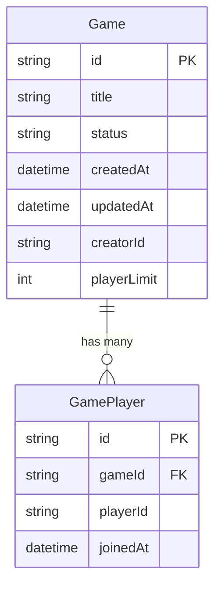

# Data Model: TOP Active Games Display

**Branch**: `005-top-active-games` | **Date**: 2025-11-18

## Overview

This document defines the data structures and relationships required for displaying active games on the TOP page. The model focuses on efficient querying and display of games with "出題中" status.

## Core Entities

### Game (Existing - Enhanced)

Represents a game session in the system.

```typescript
interface Game {
  id: string;                    // UUID
  title: string;                  // Game title
  status: GameStatus;             // '準備中' | '出題中' | '締切'
  createdAt: Date;                // Creation timestamp
  updatedAt: Date;                // Last update timestamp
  creatorId: string;              // Session ID of creator
  playerLimit: number | null;     // Maximum players (null = unlimited)
}
```

**Validation Rules:**
- `title`: Required, 1-100 characters
- `status`: Must be one of the three valid values
- `playerLimit`: If set, must be between 1 and 100

**State Transitions:**
- 準備中 → 出題中 (when game starts)
- 出題中 → 締切 (when game closes)
- No reverse transitions allowed

### GamePlayer (Existing - Referenced)

Represents a player's participation in a game.

```typescript
interface GamePlayer {
  id: string;                    // UUID
  gameId: string;                // Foreign key to Game
  playerId: string;              // Session ID of player
  joinedAt: Date;                // When player joined
}
```

## View Models (DTOs)

### ActiveGameListItem

Display representation of an active game for the list view.

```typescript
interface ActiveGameListItem {
  id: string;                    // Game ID
  title: string;                  // Display title
  createdAt: string;              // ISO 8601 timestamp
  playerCount: number;            // Current number of players
  playerLimit: number | null;     // Maximum players (null = unlimited)
  formattedCreatedAt: string;     // Human-readable date (e.g., "2時間前")
}
```

**Derivations:**
- `playerCount`: COUNT of GamePlayer records for this game
- `formattedCreatedAt`: Calculated from createdAt using relative time

### ActiveGamesResponse

API response for fetching active games.

```typescript
interface ActiveGamesResponse {
  games: ActiveGameListItem[];    // List of active games
  hasMore: boolean;                // Whether more games exist
  nextCursor: string | null;       // Cursor for next page
  total: number;                   // Total count of active games
}
```

### GameStatusFilter

Request parameters for filtering games.

```typescript
interface GameStatusFilter {
  status: GameStatus;             // Filter by status
  cursor?: string;                // Pagination cursor
  limit?: number;                 // Items per page (default: 20, max: 100)
  orderBy?: 'createdAt' | 'playerCount'; // Sort order (default: 'createdAt')
  orderDirection?: 'asc' | 'desc'; // Sort direction (default: 'desc')
}
```

## Relationships



## Database Indexes

For optimal query performance:

1. **Composite Index**: `(status, createdAt DESC)`
   - Speeds up filtering by status and ordering by creation date

2. **Foreign Key Index**: `GamePlayer.gameId`
   - Already exists, speeds up player count aggregation

## Query Patterns

### Get Active Games with Player Count

```sql
SELECT
  g.id,
  g.title,
  g.created_at,
  g.player_limit,
  COUNT(gp.id) as player_count
FROM games g
LEFT JOIN game_players gp ON g.id = gp.game_id
WHERE g.status = '出題中'
GROUP BY g.id
ORDER BY g.created_at DESC
LIMIT 20 OFFSET 0;
```

### Prisma Query Implementation

```typescript
const activeGames = await prisma.game.findMany({
  where: {
    status: '出題中'
  },
  orderBy: {
    createdAt: 'desc'
  },
  take: limit,
  skip: cursor ? parseInt(cursor) : 0,
  include: {
    _count: {
      select: {
        players: true
      }
    }
  }
});
```

## Data Transformation

### Server to Client Mapping

```typescript
function toActiveGameListItem(game: GameWithCount): ActiveGameListItem {
  return {
    id: game.id,
    title: game.title,
    createdAt: game.createdAt.toISOString(),
    playerCount: game._count.players,
    playerLimit: game.playerLimit,
    formattedCreatedAt: formatRelativeTime(game.createdAt)
  };
}
```

### Relative Time Formatting

```typescript
function formatRelativeTime(date: Date): string {
  const now = new Date();
  const diffMs = now.getTime() - date.getTime();
  const diffMins = Math.floor(diffMs / 60000);

  if (diffMins < 1) return 'たった今';
  if (diffMins < 60) return `${diffMins}分前`;
  if (diffMins < 1440) return `${Math.floor(diffMins / 60)}時間前`;
  return `${Math.floor(diffMins / 1440)}日前`;
}
```

## Caching Strategy

### React Query Cache Configuration

```typescript
const CACHE_TIME = 5 * 60 * 1000;  // 5 minutes
const STALE_TIME = 30 * 1000;      // 30 seconds

const queryOptions = {
  queryKey: ['activeGames', cursor],
  queryFn: fetchActiveGames,
  staleTime: STALE_TIME,
  cacheTime: CACHE_TIME,
  refetchInterval: 30000,          // Auto-refresh every 30 seconds
  refetchOnWindowFocus: true
};
```

## Performance Considerations

1. **Pagination**: Limit initial load to 20 games
2. **Lazy Loading**: Load additional games on demand
3. **Optimistic Updates**: Show cached data while refetching
4. **Debouncing**: Prevent rapid refresh triggers
5. **Virtual Scrolling**: For lists with 50+ items

## Migration Requirements

No database schema changes required. The existing Game and GamePlayer tables support all required queries.

## Security Considerations

1. **Public Access**: No authentication required for viewing active games
2. **Rate Limiting**: Consider implementing rate limits for API endpoints
3. **Query Limits**: Enforce maximum limit of 100 games per request
4. **Input Validation**: Validate cursor and limit parameters

## Future Enhancements

1. **Search/Filter**: Add ability to search games by title
2. **Categories**: Group games by type or category
3. **Favorites**: Allow users to favorite games
4. **Notifications**: Alert users when new games start
5. **Analytics**: Track which games get most clicks/joins