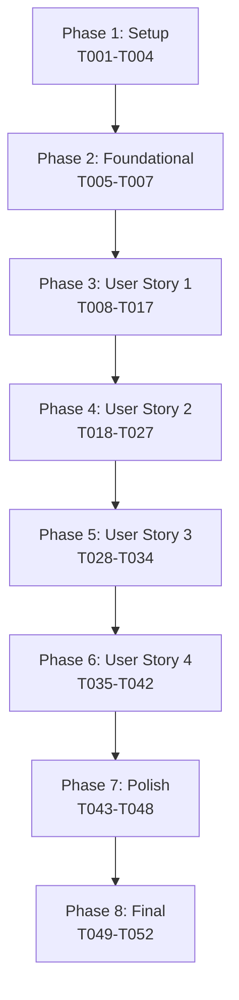

# Implementation Tasks: TOP Active Games Display

**Feature**: TOP Active Games Display
**Branch**: `005-top-active-games`
**Dependencies**: Next.js 16.0.1, React 19.2.0, Prisma 6.19.0, @tanstack/react-query ^5.0.0

## Implementation Strategy

This feature will be implemented using an MVP-first approach with incremental delivery:

1. **MVP (User Story 1 only)**: Basic active games display with filtering
2. **Enhancement 1 (User Story 2)**: Rich game information display
3. **Enhancement 2 (User Story 3)**: Navigation functionality
4. **Enhancement 3 (User Story 4)**: Auto-refresh capability

Each phase delivers independently testable value, allowing for early validation and feedback.

## Phase 1: Setup (Dependencies & Infrastructure)

**Goal**: Install required dependencies and set up React Query provider

### Tasks

- [x] T001 Install @tanstack/react-query@^5.0.0 and react-window@^1.8.10 via npm
- [x] T002 Install @types/react-window@^1.8.8 for TypeScript support
- [x] T003 Create React Query provider wrapper in src/providers/QueryProvider.tsx
- [x] T004 Update app/layout.tsx to wrap children with QueryProvider

## Phase 2: Foundational (Core Types & Contracts)

**Goal**: Establish type definitions that all user stories depend on

### Tasks

- [x] T005 [P] Create ActiveGameListItem type in src/types/game.ts
- [x] T006 [P] Create ActiveGamesResponse type in src/types/game.ts
- [x] T007 [P] Copy server action contracts from specs/005-top-active-games/contracts/server-actions.ts to src/contracts/active-games.ts

## Phase 3: User Story 1 - View Active Games [US1]

**Goal**: Display only active (出題中) games on TOP page
**Independent Test**: Access / and verify only 出題中 games appear

### Tests (TDD)

- [x] T008 [P] [US1] Write test for GetActiveGames use case filtering by status in src/server/application/use-cases/games/GetActiveGames.test.ts
- [x] T009 [P] [US1] Write test for games ordering by creation date in src/server/application/use-cases/games/GetActiveGames.test.ts
- [x] T010 [P] [US1] Write test for empty state when no active games in src/components/pages/TopPage/TopPage.test.tsx

### Implementation

- [x] T011 [US1] Implement GetActiveGames use case in src/server/application/use-cases/games/GetActiveGames.ts
- [x] T012 [US1] Create getActiveGamesAction server action in src/app/actions/games.ts
- [x] T013 [US1] Modify src/app/page.tsx to fetch active games using server action
- [x] T014 [US1] Create EmptyState component in src/components/ui/EmptyState.tsx
- [x] T015 [US1] Update TopPage component to display filtered games in src/components/pages/TopPage/index.tsx

### Integration

- [x] T016 [US1] Run tests and verify all US1 tests pass
- [x] T017 [US1] Manual test: Verify only 出題中 games appear on TOP page

## Phase 4: User Story 2 - Game Information Display [US2]

**Goal**: Show title, creation time, and player count for each game
**Independent Test**: Verify each game card shows all required information

### Tests (TDD)

- [x] T018 [P] [US2] Write test for ActiveGameCard displaying title in src/components/domain/game/ActiveGameCard.test.tsx
- [x] T019 [P] [US2] Write test for ActiveGameCard displaying player count in src/components/domain/game/ActiveGameCard.test.tsx
- [x] T020 [P] [US2] Write test for ActiveGameCard displaying formatted time in src/components/domain/game/ActiveGameCard.test.tsx

### Implementation

- [x] T021 [US2] Create ActiveGameCard component in src/components/domain/game/ActiveGameCard.tsx
- [x] T022 [US2] Create ActiveGamesList container in src/components/domain/game/ActiveGamesList.tsx
- [x] T023 [US2] Create formatRelativeTime utility in src/lib/date-utils.ts
- [x] T024 [US2] Update GetActiveGames to include player count aggregation
- [x] T025 [US2] Update TopPage to use ActiveGamesList component

### Integration

- [x] T026 [US2] Run tests and verify all US2 tests pass
- [x] T027 [US2] Manual test: Verify game information displays correctly

## Phase 5: User Story 3 - Navigate to Game Details [US3]

**Goal**: Enable clicking games to navigate to detail pages
**Independent Test**: Click any game and verify navigation to /games/[id]

### Tests (TDD)

- [x] T028 [P] [US3] Write test for ActiveGameCard navigation on click in src/components/domain/game/ActiveGameCard.test.tsx
- [x] T029 [P] [US3] Write test for hover state visual feedback in src/components/domain/game/ActiveGameCard.test.tsx

### Implementation

- [x] T030 [US3] Add Link wrapper to ActiveGameCard for navigation
- [x] T031 [US3] Add hover and focus states to ActiveGameCard with Tailwind classes
- [x] T032 [US3] Add aria-label for accessibility in ActiveGameCard

### Integration

- [x] T033 [US3] Run tests and verify all US3 tests pass
- [x] T034 [US3] Manual test: Verify clicking games navigates correctly

## Phase 6: User Story 4 - Auto-refresh Active Games [US4]

**Goal**: Automatically update game list every 30 seconds
**Independent Test**: Leave page open and verify list updates when game status changes

### Tests (TDD)

- [ ] T035 [P] [US4] Write test for useActiveGames hook with refetchInterval in src/components/pages/TopPage/hooks/useActiveGames.test.ts
- [ ] T036 [P] [US4] Write test for auto-refresh not causing scroll jump in src/components/pages/TopPage/hooks/useActiveGames.test.ts

### Implementation

- [ ] T037 [US4] Create useActiveGames custom hook in src/components/pages/TopPage/hooks/useActiveGames.ts
- [ ] T038 [US4] Update TopPage to use useActiveGames hook with 30-second interval
- [ ] T039 [US4] Add loading state indicator for refresh in TopPage
- [ ] T040 [US4] Implement optimistic updates to prevent UI flicker

### Integration

- [ ] T041 [US4] Run tests and verify all US4 tests pass
- [ ] T042 [US4] Manual test: Verify auto-refresh works without UI issues

## Phase 7: Polish & Performance

**Goal**: Optimize for large lists and edge cases

### Tasks

- [ ] T043 [P] Add pagination support for 20+ games in GetActiveGames use case
- [ ] T044 [P] Implement virtual scrolling for 50+ games using react-window
- [ ] T045 [P] Add error boundary for graceful error handling in TopPage
- [ ] T046 [P] Add loading skeleton component in src/components/ui/LoadingSkeleton.tsx
- [ ] T047 Add performance monitoring for page load metrics
- [ ] T048 Write E2E test for complete user flow in tests/e2e/top-page.spec.ts

## Phase 8: Final Integration & Cleanup

**Goal**: Ensure all components work together seamlessly

### Tasks

- [ ] T049 Run all tests (unit, integration, E2E) and ensure 100% pass
- [ ] T050 Run Biome formatter on all modified files: `npx biome format --write .`
- [ ] T051 Update CLAUDE.md with feature completion notes
- [ ] T052 Commit all changes with appropriate commit message

---

## Task Dependencies



## Parallel Execution Opportunities

### Phase 1 (Setup)
All tasks must be sequential (dependency installation)

### Phase 2 (Foundational)
```bash
# Can run in parallel (different files)
T005 & T006 & T007
```

### Phase 3 (User Story 1)
```bash
# Tests can run in parallel
T008 & T009 & T010

# After implementation, integration tests sequential
T016 → T017
```

### Phase 4 (User Story 2)
```bash
# Tests can run in parallel
T018 & T019 & T020

# Implementation mostly sequential (dependencies)
T021 → T022 → T025
```

### Phase 5 (User Story 3)
```bash
# Tests can run in parallel
T028 & T029

# Implementation sequential (simple)
T030 → T031 → T032
```

### Phase 6 (User Story 4)
```bash
# Tests can run in parallel
T035 & T036

# Implementation sequential (hook dependencies)
T037 → T038 → T039 → T040
```

### Phase 7 (Polish)
```bash
# Many can run in parallel (independent optimizations)
T043 & T044 & T045 & T046
```

## Success Metrics

- **Total Tasks**: 52
- **User Story 1**: 10 tasks (MVP - can ship after this)
- **User Story 2**: 10 tasks
- **User Story 3**: 7 tasks
- **User Story 4**: 8 tasks
- **Parallel Opportunities**: 18 tasks can run in parallel
- **Test Coverage**: 12 test tasks ensuring TDD approach

## Notes

- Each user story phase is independently deployable
- Tests are written first (TDD) for each story
- The MVP (US1) provides immediate value
- Auto-refresh (US4) is optional but enhances UX
- Performance optimizations in Polish phase handle scale